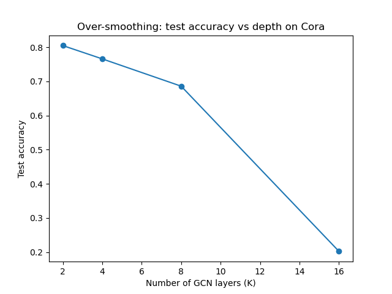

# Week 5 - Answers


---

## Q1. Normalizing the Adjacency Matrix

Graph is Node1 — Node2 — Node3 (just a straight line of 3 nodes, Node2 is in middle so it touch both other ones).

**Adjacency and degree matrix**

$$A = \begin{pmatrix} 0&1&0\\1&0&1\\0&1&0 \end{pmatrix}, \quad D = \begin{pmatrix} 1&0&0\\0&2&0\\0&0&1 \end{pmatrix}$$

Node1 and Node3 only have 1 neighbor each so their degree is 1, Node2 have 2 neighbor so degree 2. Pretty simple, $D$ is just diagonal matrix of how many edges each node have.

**Adding self loops**

Now we do $\tilde{A} = A + I_3$, basically just put 1 on the diagonal too (so each node "connect" to itself also). Because of this every node degree go up by exactly 1:

$$\tilde{A} = \begin{pmatrix} 1&1&0\\1&1&1\\0&1&1 \end{pmatrix}, \quad \tilde{D} = \begin{pmatrix} 2&0&0\\0&3&0\\0&0&2 \end{pmatrix}$$

**Doing the normalization by hand**

$\tilde{D}^{-1/2}$ is diagonal matrix, its just $1/\sqrt{\tilde d_i}$ for each node, so here it will be $1/\sqrt2, 1/\sqrt3, 1/\sqrt2$. When we put $\tilde{A}$ in between two of these ($\tilde{D}^{-1/2}\tilde{A}\tilde{D}^{-1/2}$), every entry gets multiply by $\frac{1}{\sqrt{\tilde d_i}\sqrt{\tilde d_j}}$. So I calculate each entry one by one:

- $\hat{A}_{11} = \frac{1}{\sqrt{2}\cdot\sqrt{2}} = \frac{1}{2} = 0.5$
- $\hat{A}_{22} = \frac{1}{\sqrt{3}\cdot\sqrt{3}} = \frac{1}{3} \approx 0.333$
- $\hat{A}_{33} = \frac{1}{\sqrt{2}\cdot\sqrt{2}} = \frac{1}{2} = 0.5$
- $\hat{A}_{12} = \hat{A}_{21} = \frac{1}{\sqrt{2}\cdot\sqrt{3}} = \frac{1}{\sqrt{6}} \approx 0.408$
- $\hat{A}_{23} = \hat{A}_{32} = \frac{1}{\sqrt{3}\cdot\sqrt{2}} = \frac{1}{\sqrt{6}} \approx 0.408$
- $\hat{A}_{13} = \hat{A}_{31} = 0$ (they not connected, and self loop dont make new edge between them)

So final matrix is:

$$\hat{A} \approx \begin{pmatrix} 0.5 & 0.408 & 0\\ 0.408 & 0.333 & 0.408\\ 0 & 0.408 & 0.5 \end{pmatrix}$$

I also check this in code (`Week5_GCNs.ipynb`, first cell) to make sure I didnt mess up the arithmetic, and numbers come out exactly same, so this should be correct.

**Conceptual part: how the message from high degree neighbor is weighted?**

Looking at formula $\hat{A}_{ij} = \frac{1}{\sqrt{\tilde d_i}\sqrt{\tilde d_j}}$, we can see that if $j$ has bigger degree, the weight get smaller. Like in our example, Node2 has degree 3 (after self loop) and its message to Node1/Node3 is scaled by only $1/\sqrt6 \approx 0.408$. If Node2 had lower degree, this number would be closer to like 0.5-0.7, so bigger weight.

Basically it mean a "popular" node (many neighbors) don't get to dominate the aggregation just because it has more edges — its influence per-neighbor gets divided down. And a node with less connections gets relatively louder voice. I think this is good design choice because otherwise hub nodes would just overpower everything in the network only because they are well connected, not because their info is actually more important. It also help keep the numbers in similar range no matter what the degree is, which should make training more stable (i think this is kind of like normalizing so gradients dont blow up).

---

## Q2. Implementing One GCN Layer

Code for numpy GCN layer + testing it on Q1's graph is inside `Week5_GCNs.ipynb`.

**Quick check part: should we do $(\hat{A}X)W$ or $\hat{A}(XW)$ first, if $N \gg F$?**

We should do $\hat{A}(XW)$ first — meaning shrink the feature size first, THEN do the graph aggregation.

Reasoning: $X$ is shape $N \times F$ and $W$ is $F \times F'$. If we compute $XW$ first, cost is $O(NFF')$ and result is small matrix $N \times F'$. Then multiplying with big $\hat{A}$ (which is $N \times N$) costs $O(N^2F')$.

But if we do $\hat{A}X$ first instead, we are multiplying the huge $N\times N$ matrix with the wider $N \times F$ one, so it cost $O(N^2F)$, and only after that we apply $W$. Since usually $N$ is WAY bigger than $F$ or $F'$ (like thousands of nodes vs maybe 16 or 64 features), the $O(N^2 \cdot \text{something})$ part is what really matters, so we want that "something" (the width) to be as small as possible before we hit the expensive step. That means shrinking with $W$ first is better. This matters even more in real life because $\hat{A}$ is usually stored as sparse matrix, and sparse times dense multiply cost depends on how wide the dense side is.

---

## Q3. Why Do We Need Self-Loops?

**Short proof that eigenvalue of $D^{-1/2}AD^{-1/2}$ is in $[-1,1]$**

We already given that normalized Laplacian $L = I_N - D^{-1/2}AD^{-1/2}$ has its eigenvalues somewhere in $[0,2]$.

So say $\lambda$ is an eigenvalue of $D^{-1/2}AD^{-1/2}$, with eigenvector $v$, meaning $D^{-1/2}AD^{-1/2}v = \lambda v$. Then if we plug into $L$:

$$Lv = (I_N - D^{-1/2}AD^{-1/2})v = v - \lambda v = (1-\lambda)v$$

So this means $v$ is ALSO an eigenvector of $L$, but with eigenvalue $(1-\lambda)$ instead. And since we know every eigenvalue of $L$ must be in $[0,2]$:

$$0 \le 1-\lambda \le 2$$
$$-1 \le -\lambda \le 1$$
$$-1 \le \lambda \le 1$$

So that proves every eigenvalue of $D^{-1/2}AD^{-1/2}$ must be between $-1$ and $1$. $\blacksquare$

**Numerical check part:** I ran this on `networkx.karate_club_graph()` (see `Week5_GCNs.ipynb`, Q3 section). This is what actually came out:

```
I_N + D^-1/2 A D^-1/2 range: 0.3078 to 1.99999999999999...
Renormalized D~^-1/2 A~ D~^-1/2 range: -0.5819 to 1.0
```

So the un-renormalized one's biggest eigenvalue basically touches the ceiling of 2 (matches what we proved, since it should be in $[0,2]$) — and that is the dangerous part, because if eigenvalue is almost exactly 2, raising it to a power (like stacking many layers) will make it blow up super fast. The renormalized version instead has its max eigenvalue capped right at 1.0, which I think is the actual reason renormalizing helps with stability: stacking $K$ layers is kinda like raising the matrix to power $K$ along each eigen-direction, and $1^K$ stays fine forever while $2^K$ explodes really quick.

(One thing I noticed — the minimum for renormalized was about $-0.58$, so it's not COMPLETELY inside $[0,1]$ like the assignment text kind of implies, at least not for this graph. But it is still safely inside the $[-1,1]$ bound I proved above, and most important, its nowhere close to the unstable edge at 2. So I think the "stays within $[0,1]$" claim in assignment is more like a rough/typical case, not a strict guarantee.)

**Conceptual part: what do we lose if there's no self-loop?**

If we never add $I_N$ to $A$, then $\hat{A}$ would have all zeros on diagonal. That means when we compute $H = \hat{A}XW$, each node's new value only come from its neighbors, and the node's OWN current features never get included in its own update at all. So basically every GCN layer would completely throw away what the node knew about itself before, and just replace it with some blend of its neighbors instead.

If you stack couple layers like this with no self loop, the node's original identity/features basically disappear completely after a while — that's real info getting lost. This is exactly what self loops are there to prevent — they give every node a kind of "path" for its own identity to survive through the layer, sort of similar idea to residual connections in normal neural nets.

---

## Q4. Over-Smoothing in Deep GCNs

I trained a K-layer GCN (16 hidden units, Adam optimizer, 200 epochs) on Cora dataset for K = 2, 4, 8, 16 (all code is in `Week5_GCNs.ipynb`). Here is the actual test accuracy I got:

| K (layers) | Test accuracy |
|---|---|
| 2  | 0.805 |
| 4  | 0.766 |
| 8  | 0.686 |
| 16 | 0.202 |



Accuracy keep dropping as we add more layers, and it basically collapse at K=16 (0.202 is only a tiny bit better than just randomly guessing among Cora's 7 classes, which would be about 0.14). This looks like exactly the over-smoothing pattern the question is asking about.

**Conceptual part: why does stacking more layers make embeddings all look same?**

Each GCN layer is basically taking a weighted average of a node with its neighbors ($\hat{A}XW$ — the $\hat{A}X$ part is literally an averaging step, before we even apply $W$). So after 1 layer, a node's embedding contain info from its 1-hop neighbors. After 2 layers, its 2-hop neighbors. And so on.

Problem is, in a real graph, the number of nodes you can reach within $k$ hops grows really fast (small-world type effect), so once $k$ gets big enough, basically every node's "neighborhood" covers most of the whole graph, and they start overlapping a LOT with each other. If every node is averaging over pretty much the same giant neighborhood, then all their embeddings start converging to same value — like they all approach the graph's overall average feature vector, and whatever local structure that used to make different classes look different just gets washed out.

Once that happens, the classifier at the end has basically nothing left to work with, because it's trying to separate points that all collapsed into almost the same spot in embedding space. Thats exactly why accuracy crashes so hard at K=16 in the table above.

---